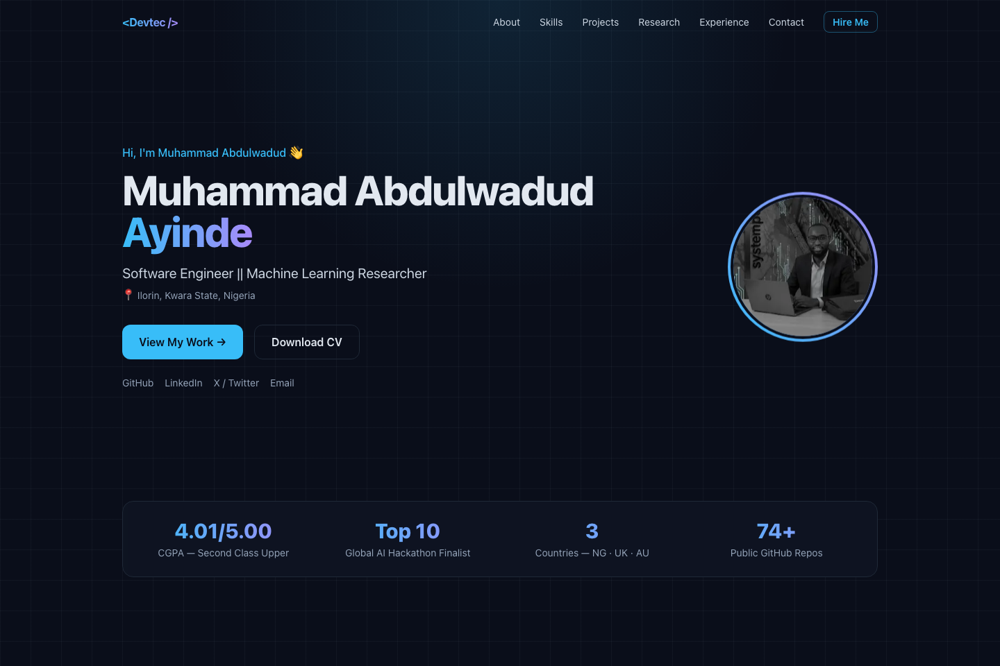
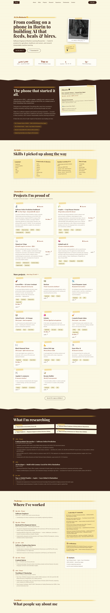

# 👨‍💻 Muhammad Abdulwadud Ayinde — Portfolio

> **Software Engineer || Machine Learning Researcher** · Ilorin, Nigeria

[](https://nextjs.org)
[](https://www.typescriptlang.org)
[](https://tailwindcss.com)
[](LICENSE)

🌐 **Live:** [devtec-portfolio.vercel.app](https://vercel.com/new) <!-- ← update after Vercel deploy -->
📄 **CV:** [resume.pdf](public/resume.pdf)

---

## ✨ Preview



<details>
<summary>🔍 <b>Full page view</b> — click to expand</summary>
<br>



</details>

---

## 🎯 About Me

I'm a software engineer and machine learning researcher building AI products that solve
real problems for real people — an offline-capable maternal health triage assistant, a
multilingual crop disease detector for farmers, and interpretable ML research in software
defect prediction. I started coding on a phone in Ilorin, Nigeria.

- 🎓 **B.Sc. Computer Science**, Kwara State University (Second Class Upper)
- 🏆 **Top 10 Global Finalist** — Aspire × Cayu Global AI Hackathon (Jan 2026)
- 🌍 **Engineering experience in 3 countries** — Nigeria 🇳🇬 · UK 🇬🇧 · Australia 🇦🇺
- 🔬 **Research:** Interpretable & uncertainty-aware ML, TabNet, digital health AI

---

## 🚀 Featured Work

| Project | What it does | Links |
|---|---|---|
| 🔬 **Software Defect Prediction** ⭐ *Final Year Project* | TabNet deep learning on NASA CM1 dataset — 95% recall, live dashboard translating attention weights into Z-score deviations | [Live ↗](https://software-def.onrender.com) |
| 🌾 **CropDx** | Field-first crop disease detection for farmers — classical ML pipeline (HSV/GLCM/OpenCV + RBF SVM), 10-language voice guide for low-connectivity regions | [Live ↗](https://devtec-3.github.io/Crop-disease-detectors/) · [Code ↗](https://github.com/Devtec-3/Crop-disease-detectors) |
| 🩺 **MamaCare Triage** | Offline-capable multimodal AI triage for rural clinics (Gemma function-calling), Yoruba-language outputs — UN SDG 3 | [Live ↗](https://mamacare-triage.onrender.com/) · [Code ↗](https://github.com/Devtec-3/MamaCare-Triage) |
| 🧠 **GlobalCoach AI** | AI career orchestration platform — Gemini 1.5 Flash semantic job matching, PostgreSQL + Drizzle ORM, analytics dashboard | [Code ↗](https://github.com/Devtec-3/GlobalCoachAI) |
| 🚀 **CareerPilot** | AI career assistant — ATS CV review, roadmaps, interview prep | [Live ↗](https://my-fintech-app.onrender.com/) · [Code ↗](https://github.com/Devtec-3/CareerPilot) |
| 🛍️ **Dehelar** | Full-stack TypeScript web application deployed on Vercel & Render | [Live ↗](https://dehelar.onrender.com/) · [Code ↗](https://github.com/Devtec-3/Dehelar) |
| 💇 **Cosmetic Beauty Salon** | Client project — salon website with service showcase & booking-oriented layout | [Live ↗](https://cosmetic-beauty-salon-web.vercel.app/) · [Code ↗](https://github.com/Devtec-3/Cosmetic-Beauty-Salon-Web) |
| 🍽️ **Black Diamond Menu** | Client project — full-stack digital restaurant menu with API service | [Live ↗](https://black-diamond-menu-website-api-serv.vercel.app/) · [Code ↗](https://github.com/Devtec-3/Black-Diamond-Menu-Website) |

---

## 🛠️ Tech Stack

| Layer | Technologies |
|---|---|
| **Framework** | Next.js 14 (App Router), React 18 |
| **Language** | TypeScript (strict mode) |
| **Styling** | Tailwind CSS 3, custom design system |
| **Animations** | IntersectionObserver scroll-reveal, CSS keyframes |
| **Deployment** | Vercel (fully static — ~93 kB first load) |

---

## 📄 Site Sections

- 🏠 **Hero** — identity, photo, CTAs + stats band (CGPA · hackathon · countries · repos)
- 👤 **About** — bio, education, coursework, quick facts
- 🛠️ **Skills** — languages, frameworks, ML/AI, data & tools
- 💼 **Projects** — featured case studies (incl. final year project) + other notable work
- 🔬 **Research** — interests + research experience timeline
- 🏢 **Experience** — Pacific Artis (AU), BitsPro (UK), SystemSpecs/Remita (NG), Trayce + teaching
- 💬 **Testimonials** — LinkedIn recommendations
- ⭐ **Leadership** — NACOS Chairman, Kectil Fellow, Aspire Leader, community work
- ✉️ **Contact** — email + GitHub, LinkedIn, X, Instagram, Facebook

---

## ⚡ Getting Started

```bash
# 1. Clone
git clone https://github.com/Devtec-3/devtec-portfolio.git
cd devtec-portfolio

# 2. Install
npm install

# 3. Run
npm run dev
```

Open [http://localhost:3000](http://localhost:3000) 🎉

### Production

```bash
npm run build   # optimized static build
npm run start   # serve production build
```

---

## 🧱 Project Structure

```
devtec-portfolio/
├── app/
│   ├── layout.tsx      # Root layout + SEO metadata
│   ├── page.tsx        # Section assembly
│   ├── globals.css     # Design system (cards, chips, gradients)
│   └── icon.svg        # Favicon
├── components/
│   ├── Navbar.tsx      # Sticky nav + mobile menu
│   ├── Hero.tsx        # Intro + stats band
│   ├── About.tsx       # Bio + education
│   ├── Skills.tsx      # Skill groups
│   ├── Projects.tsx    # Featured + other work
│   ├── Research.tsx    # Research interests & timeline
│   ├── Experience.tsx  # Industry timeline + leadership + certs
│   ├── Contact.tsx     # Email + socials
│   ├── Footer.tsx
│   └── Reveal.tsx      # Scroll-reveal animation wrapper
├── lib/
│   └── data.ts         # ✏️ ALL site content lives here
├── public/
│   ├── me.jpg          # Profile photo
│   └── resume.pdf      # Downloadable CV
└── docs/               # Screenshots
```

---

## ✏️ Customizing

Everything is driven by **one file** — [`lib/data.ts`](lib/data.ts):

| Change | Location |
|---|---|
| Name, role, bio, socials | `profile` |
| Education | `about.education` |
| Skills | `skills` |
| Projects | `projects` array |
| Research | `research`, `researchInterests` |
| Experience | `experience` |
| Leadership / Certifications | `leadership`, `certifications` |

Swap `public/me.jpg` for your photo and `public/resume.pdf` for your CV — done.

---

## 🌍 Deploy on Vercel

1. Push this repo to GitHub
2. [vercel.com/new](https://vercel.com/new) → Import → Deploy
3. Live on a free `*.vercel.app` domain 🚀

---

## 📫 Connect

[](https://github.com/Devtec-3)
[](https://www.linkedin.com/in/devtec3)
[](https://x.com/devtec_33)
[](mailto:muhammadabdulwadudalata@gmail.com)

---

<p align="center"><i>Designed & engineered by <b>Devtec</b> · Built with Next.js & Tailwind CSS</i></p>
